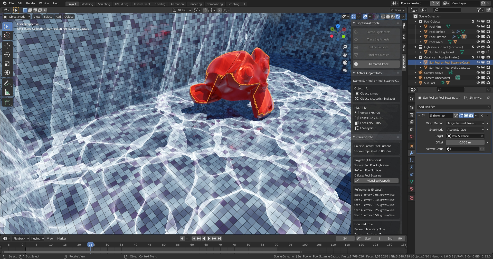

# Lightsheet - Caustics for Cycles and EEVEE

[Blender](http://www.blender.org) is a free and open source 3D computer graphics software toolset.
For rendering images Blender includes a path-tracer called Cycles and a real-time renderer named EEVEE.
However both render engines are not suitable for scenes where sharp reflections or refractions create [caustics](https://en.wikipedia.org/wiki/Caustic_(optics)).

**Lightsheet** is a Blender Add-on for creating fake caustics that can be rendered with Cycles and EEVEE.
The caustics are transparent meshes that wrap around objects with a diffuse material and show up like a glowing decal.
The Add-on will create caustics before rendering, therefore they will be rendered quickly with EEVEE and provide indirect lighting with Cycles.

Cycles:


EEVEE in 3D-View:




## Installation

**Dowload link** (for Blender 2.83, 2.9 and 3.1): https://github.com/markus-ebke/Blender-Lightsheet/releases/latest

Download the .zip file.
In Blender's preferences window go to the Add-ons section and use the `Install...` button to install it.
The operators will be placed in a new panel in the 3D-View sidebar, progress for long running operators is printed to the terminal window.
There is a combination of settings where Blender 2.8 might crash! See [Drawbacks](#drawbacks).

Example file: [Lightsheet Examples.blend](./examples/Lightsheet%20Examples.blend)

Thread on blenderartists.org: https://blenderartists.org/t/lightsheet-caustics-for-cycles-and-eevee/1292193


## How it works

Imagine a lamp sends out an elastic sheet made of light such that each point on the sheet travels along a ray of light.
As the sheet moves through the scene and interacts with surfaces, it deforms due to reflection and refraction.
When it finally reaches a diffuse material, it becomes visible to the camera.
In places where the lightsheet gets stretched its intensity will be lower, where it gets squeezed together the intensity will be higher and where it's folded on top of itself the intensities add up.

To model such a lightsheet the Add-on creates a mesh assigned to each given light.
It traces a ray for each vertex in the mesh, generating new vertices whenever a diffuse object gets hit.
These caustic vertices are connected by faces following the topology of the original sheet.
The size of the new caustic face compared with the size of the original lightsheet face determines the caustic's brightness.

This technique has been used before: [Rendering Realtime Caustics in WebGL](https://medium.com/@evanwallace/rendering-realtime-caustics-in-webgl-2a99a29a0b2c).


## Drawbacks

- Smoothness of light sources is not supported (no area lamps, no mesh lights).
- Roughness of reflective/refractive materials is not supported and their shader node tree must be relatively simple (output is connected to Transparent, Glossy, Glass or Principled BSDF or a Mix or Add Shader node with one of the preceding BSDFs as input), otherwise they are treated as diffuse.
- Textures controlling reflection/refraction/transparency color are not supported.
- Bump mapping is not supported, all deformations must be part of the reflective/refractive/transparent mesh (e.g. with displace modifier), however smooth shading is supported.
- Caustics may wrap poorly around curved objects (changing the offset parameter of the shrinkwrap modifier may help).
- Ray-tracing is single threaded and slow (because it's partly implemented in Python).
- The algorithm to adaptively add more detail to caustics may fail, when complicated raypaths create holes in the caustic mesh (use *Undo* and try again with lower error threshold).
- Animation of caustics is possible, but needs a lot of memory and will create huge files.

EEVEE:
- Diffuse objects that use textures must be UV-unwrapped and the diffuse color texture must be copied by hand to the corresponding caustic material.
- At UV-seams the caustic may look deranged (because coordinates are interpolated).
- Caustics will not show up in Screen Space Reflections/Refractions, however they will be visible to light probes.

Cycles:
- There will be render artifacts where the caustic is folded on top of itself.
    I included a setting to mitigate this, but it takes a long time, uses a lot of memory and creates large files.
    Also this setting might crash Blender 2.83, because there seems to be a bug in `mathutils.geometry.delaunay_2d_cdt` (bug is fixed for Blender 2.9 and above).

If one of these points is a problem for you, just use [LuxCoreRender](https://luxcorerender.org) or [YafaRay](https://github.com/YafaRay) or [appleseed](https://appleseedhq.net)!


# Manual

All operators can be reached from the sidebar in the 3D viewport.
Note that initial tracing, refinement, cleanup and animation will take some time to complete (several seconds up to a few minutes) and block the user interface.
A progress report is printed to the terminal window.

You need to setup your scene beforehand, it should contain at least a lamp (sun, spot or point light), a reflective/refractive object (with a material that has zero roughness) and a diffuse object (where the caustics will show up).
And if you render with Cycles, you should disable reflective and refractive caustics in the light paths settings.


1. **Create lightsheet for lamp**

    

    Select the lamp and click the **Create Lightsheets** button. If you have small or detailed reflective/refractive objects you should increase the resolution.
    For point lights the lightsheet completely surounds it, for spots the lightsheet only fills the light cone.
    For sun lights you need to scale and move the lightsheet such that it "shadows" the reflective/refractive objects.

2. **Trace lightsheet to get caustics**

    

    Select the newly created lightsheet objects and click the **Trace Lightsheets** button, the max bounces setting works similar to the light bounces setting in Cycles.
    Note that the number of possible caustic paths increases exponentially with the number of bounces.
    Each path that contains at least one reflection/refraction will give a caustic object.
    After tracing has finished there should be several new objects in the scene that are part the the caustic collection (see the outliner for the complete list).
    Delete any caustics that you don't want (or that are too dim).

3. **For EEVEE: Adjust caustic material**

	

	If you want to render with EEVEE, you need to adjust the texture of the caustic material.
	Copy the diffuse texture from the parent object and connect it instead of the checkerboard node marked in red.
	If the parent object has no texture, disconnect the node and set the diffuse color in the Mix RGB node.

4. **Refine caustics for more detail**

    

    Select the caustics that you want to refine and click the **Refine Caustics** button.
    A lower error threshold will give better looking caustics at the cost of more computation time and memory.
    You can repeat this step a few times, increasing the error threshold in each iteration.
    (Note that, to avoid testing all edges every time the operator is used, only edges that are *Marked as Seam* will the tested.)

5. **Cleanup and finalize caustics**

    

    When you are done with refinement click the **Finalize Caustics** button with your caustics still selected.
    Apart from deleting some internal data you can feather the boundary of the caustic and remove faces that are too dim.
    If you render with Cycles you need to use the *Cycles: Fix Overlap Artifacts* setting to get rid of some dark spots were the caustics are folded a lot.
    Note that this will usually take a long time and use a lot of memory.
    (You can delete faces, e.g. those that are not visible to the camera, to speed up this process and save memory.)

6. **Optional: Animation**

    

    If any of the lamps or reflective/refractive/diffuse objects are animated (change location or rotation), you also need to animate the caustics.
    Select the finalized caustics that you want to animate and use the **Animated Trace** operator.
    The settings of the existing caustics serve as a reference for all other frames.
    Note that this will create large files because new caustic objects will be created for every frame.

    


## Hidden Features

- The caustics use a shrinkwrap modifier to wrap around their diffuse object.
    If you render with Cycles, then a larger offset will smooth out the caustic and you can use that to simulate caustics of smooth lights.
- Only edges that are marked as seams will be tested for refinement (and those edges that are not marked will be skipped).
    If you only want to refine a specific area (or exclude an area), go into edit mode and mark the appropriate edges via `CTRL+E > Mark Seam, Clear Seam`.
Then use the **Refine Caustics** operator with `Error Threshold` set to 0.0.
- Every caustic vertex originated from some point on the lightsheet.
    The coordinates of this point are accessible from the caustic via two UV-layers.
    Since they are not necessary for the look of the caustic, they will be delete by the finalize operator.
    But these coordinates could be used to project an image onto a diffuse object, when the light shines through a lens or hits a mirror or similar.
    (This is also solves the question at https://blender.stackexchange.com/q/90698.)
    Here is the Blender logo projected onto a deformed golden mirror and a block of glass:

    


## More Pictures!

- BlenderDiplom has an article about rendering caustics: [Rendering Caustics in Blender with appleseed](http://www.blenderdiplom.com/en/tutorials/all-tutorials/649-rendering-caustics-in-blender-with-appleseed.html).
    Here is the same scene with caustics created by the *Lightsheet* Add-on and rendered with Cycles:

    

- With Cycles the caustics are visible when seen in a mirror or through water;

    

- With *Lightsheet* you can compute water reflection and refraction caustics easily.
    Project the caustics onto a plane, then set up an orthographic camera perpendicular to that plane.
    The rendered images can also be used as a texture (then you don't have to worry about the high memory usage needed for detailed caustics).
    The animations below are looping and tileable (I used [this trick](https://blender.stackexchange.com/a/2864) to make the ocean modifier looping):

    
    


# Contributing

Contributions are always welcome and greatly appreciated.
Here is how you can help:

- Report bugs at https://github.com/markus-ebke/Blender-Lightsheet/issues.
    Please include your Blender version and any details about your local setup that might be helpful in troubleshooting.
- Submit feature requests: file an issue and label it with `enhancement`.
- Add documentation: Except for the [Manual](#manual) section there is no further documentation.
    Maybe there should be more?
- Implement features: Any GitHub issue tagged with `enhancement` is open to whoever wants to implement it.


For development I suggest you follow these steps:
1. Fork this project (via the button on the Github page) and clone it locally:
    ```shell
    $ git clone git@github.com:<your_name_here>/Blender-Lightsheet.git
    ```

2. Install [pre-commit](https://pre-commit.com) and automatically install the git hook scripts with
    ```shell
    $ pip install pre-commit
    $ cd Blender-Lightsheet/
    $ pre-commit install
    ```
    This will run some checks before every commit and also take care of basic formatting via [isort](https://pycqa.github.io/isort) and [autopep8](https://pypi.org/project/autopep8/).

3. Optional: You may use a linter like [pylint](https://pylint.org) or [flake8](https://flake8.pycqa.org/en/latest), but I found them cumbersome since Blender's python modules are not easy to access from outside Blender.
    You can install [fake-bpy-module](https://github.com/nutti/fake-bpy-module) to help with code completion, but the linters always gave me lots or errors.
    Anyways, I left a `.pylintrc` and a `.flake8`-file in the repository, just in case.

4. I suggest you create a branch for local development, e.g. like this:
    ```shell
    $ git checkout -b <name-of-your-feature>
    ```

5. You can add Blender files and images to show off new features or interesting use cases.
    Please put them in the `Blender-Lightsheet/example/` folder.
    - When saving Blender files use the `Compress File` option, also don't include the computed caustics as they make the files very big.
    - For images I noticed that the JPEG-option with quality 98% gives good results and smaller files than PNG.
    - For animations I used GIF because I failed embedding looping MP4 videos in this README.
    I created them with [ImageMagick](https://imagemagick.org) (and I had to change some the settings in ImageMagick's [policy.xml](https://imagemagick.org/script/resources.php) to get it working):
        ```shell
        $ convert -fuzz 5% -delay 4 -loop 0 render/*.png -scale 640x360 -layers OptimizePlus -layers OptimizeTransparency animation640x360.gif
        ```
    Did you know that you can preview markdown with [grip](https://pypi.org/project/grip/)?
    While modifying `README.md` you can preview the changes in your browser:
    ```shell
    $ grip -b
    ```

7. Commit your changes and push your branch to GitHub:
    ```shell
    $ git add .
    $ git commit -m "Description of your changes"
    $ git push origin <name-of-your-feature>
    ```
    With the commit messages I tried to follow [How to Write a Git Commit Message](https://chris.beams.io/posts/git-commit/).

8. Submit a pull request through the GitHub website and I will have a look.


## Changelog

**v1.0 (2021-03-17)**
- First public release
